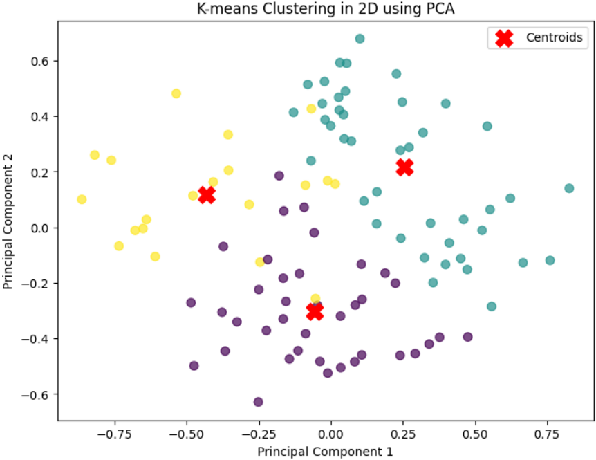

# Customer Segmentation and Clustering

## Description:
This project demonstrates the process of customer segmentation using K-means clustering and dimensionality reduction (PCA). The objective is to segment customers into different groups based on features like annual income and spending score. PCA is used for reducing the dimensionality of the data, making it easier to visualize the clusters in 2D.

## Requirements:
To run the project, make sure you have the following Python libraries installed:
- `numpy`
- `pandas`
- `matplotlib`
- `seaborn`
- `scikit-learn`

You can install them using `pip`:
```bash
pip install numpy pandas matplotlib seaborn scikit-learn
```

## How to run:
1. Clone the repository to your local machine:
```bash
git clone https://github.com/your-username/Customer-Segmentation-and-Clustering.git
```
## Example Visualization:
Below is an example of the resulting cluster visualization after running the script:
The plot visualizes customer segments in two dimensions, with each color representing a different customer cluster.




